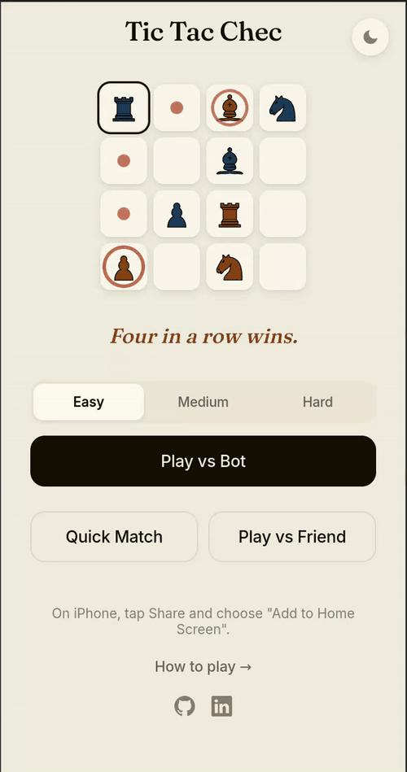
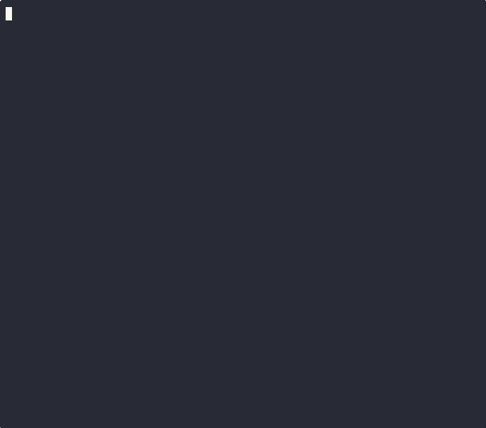
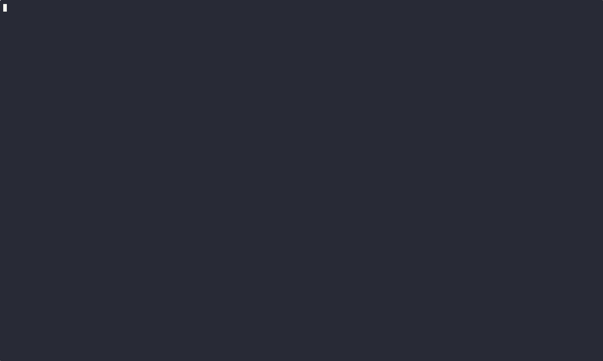

# Chess Tic-Tac-Toe (Tic Tac Chec)

A pet project where I learn two things at once:

1. **Go, in depth.** Every line of Go in this repo is written by me. Claude Code acts as a teacher via its [Learning output style](https://code.claude.com/docs/en/output-styles), explaining concepts and guiding design decisions instead of generating the code for me.
2. **Shipping things fast with AI agents, pretending it's production.** The web UI, CSS/JS, Caddy and Docker configs, GitHub Actions pipelines, and the Python RL training pipeline were built with heavy help from Claude. Claude Code agents also ran and monitored bot training for me — kicking off runs, watching checkpoints, reporting back.

So it's not vibe-coded — the Go core is mine and I understand every bit of it — but it's not hand-coded either. The second skill I'm deliberately practicing is knowing when to lean on agents, when to step in, and how to review their output critically.

Along the way this project has also been a vehicle for learning reinforcement learning (PyTorch → ONNX, AlphaZero-style MCTS), WebSocket protocol design, SQLite with migrations, SSH server hosting, PWAs, and whatever else a hybrid chess/tic-tac-toe game decides it needs.

### How the "play vs bot" feature happened (a representative slice)

To turn the site from "invite a friend" into "visit → play immediately" I needed a bot opponent. Instead of hand-rolling heuristics, I used it as an excuse to learn RL end-to-end:

1. Learn RL fundamentals with Claude as tutor.
2. Build an AlphaZero-style policy/value network with MCTS (PyTorch), guided by Claude.
3. Train it — Claude Code agents launched runs, monitored checkpoints, tweaked hyperparameters, and surfaced results.
4. Ship inference to Go via ONNX Runtime on the server.
5. Problem: the trained bot was too strong for casual visitors. So I learned how to tune difficulty (MCTS simulation budget + earlier checkpoints), designed a difficulty selector, and added it to the UI.

Every step here was something I didn't know how to do before.

## 👉 Play it: [ttc.ctln.pw](https://ttc.ctln.pw)

No install, no signup. Pick a difficulty and play against a bot, or invite a friend with a link.

<p align="center">
  <a href="https://ttc.ctln.pw"></a>
</p>

## Rules

- 4×4 board, 2 players: White and Black
- Each player has 4 pieces: Pawn, Rook, Bishop, Knight
- On your turn: **place** a piece from hand onto any empty cell, or **move** a piece on the board (chess-style movement)
- Capturing a piece returns it to its **owner's** hand (shogi-style)
- Pawns reverse direction when reaching the far edge
- **Win**: get 4 of your pieces in a row — horizontal, vertical, or diagonal

## What's Inside

A single game; many ways to play it, and a small zoo of things to learn from:

- **`engine/`** — pure Go game logic, no I/O. The heart of the project; every frontend talks to this.
- **`cmd/web/`** — Go HTTP + WebSocket server with a vanilla-JS frontend. PWA-enabled, PvP with auto-pairing lobby, reconnect, rematch, emoji reactions, sounds, and play-vs-bot at three difficulty levels.
- **`cmd/ssh/`** — SSH server (wish + Bubble Tea middleware) so you can play over `ssh`.
- **`cmd/tui/`** — standalone local TUI (Bubble Tea).
- **`cmd/cli/`** — Kong-based CLI used by the Claude Code skill (one move per invocation).
- **`bot/`** — RL bot. Python trains an AlphaZero-style policy/value network (PyTorch, MCTS, opponent-pool self-play), then exports to ONNX; Go serves inference via `onnxruntime_go`. The `easy`/`medium`/`hard` selector on the home page picks among trained checkpoints and MCTS simulation budgets.
- **`claude-skill/`** — Claude Code skill that lets Claude play against you in the terminal and learns from its losses (see below).
- **`internal/game/`** — room/player/channel-based game multiplexing with reconnect support.
- **`internal/wire/`** — JSON message types shared by web and CLI clients.
- **Persistence** — SQLite (modernc driver) + `goose` migrations. Active PvP and bot games survive server restarts.
- **Docs for LLM players** — [`/llms.txt`](https://ttc.ctln.pw/llms.txt) describes the WebSocket protocol so LLM agents can connect and play.

## Run Locally

Web server (browser UI, PvP + vs bot):

```bash
go run ./cmd/web
# → http://localhost:8080
```

Standalone TUI:

```bash
go run ./cmd/tui/
```

[](https://asciinema.org/a/EBRFrNjgfLJ6Q7rp)

## Play Over SSH

[](https://asciinema.org/a/y841iuATvfSxSNDF)

```bash
ssh ttc.ctln.pw -p 2222
```

- Auto-pairing lobby
- Turn indicator and board flip (Black sees the board from their side)
- In-game rules screen (`?`)

## Self-Hosting

Run web + SSH with Docker Compose (includes Caddy reverse proxy for HTTPS):

```bash
cp .env.example .env
docker compose up -d
```

This starts:
- **Web server** on port 80/443 (via Caddy reverse proxy)
- **SSH server** on port 2222

Configure your domain in `Caddyfile`. SSH host keys and the SQLite database are persisted in Docker volumes across redeploys.

### Optional analytics

The web app can load PostHog when you enable it explicitly in `.env`:

```bash
ANALYTICS_ENABLED=true
POSTHOG_KEY=phc_your_project_key
POSTHOG_HOST=https://eu.i.posthog.com
```

## Claude Code Skill

Play against Claude in your terminal using the [Claude Code](https://docs.anthropic.com/en/docs/claude-code) skill.

[](https://asciinema.org/a/oq6SKUqsB7aM7iwm)

### How it works

The skill teaches Claude to play the game through a CLI binary. On each turn, Claude runs `tic-tac-chec-cli move` to make moves and reads the board output to decide its next action. You communicate moves in natural language ("pawn to b3") and Claude translates them into CLI commands.

When Claude loses, it performs a post-game analysis: reconstructs the game move-by-move, identifies where it went wrong, and writes a concrete lesson to the "Lessons Learned" section of its skill file (`~/.claude/skills/play-tic-tac-chec/SKILL.md`). If the same lesson appears three times, it gets promoted into the main Strategy section. Over time, Claude builds a personalized playbook from its failures.

### Requirements

- Go 1.25+
- [Claude Code](https://docs.anthropic.com/en/docs/claude-code) CLI

### Install

```bash
make install-skill
```

Then restart Claude Code and say `/play-tic-tac-chec`.

## Controls (TUI / SSH)

| Key | Action |
|-----|--------|
| ↑ ↓ ← → / h j k l | Move cursor |
| Enter / Space | Select piece / confirm move |
| ? | Rules screen |
| N | New game (after game over) |
| C | Cycle color scheme |
| S | Toggle status overlay |
| Q | Quit |
