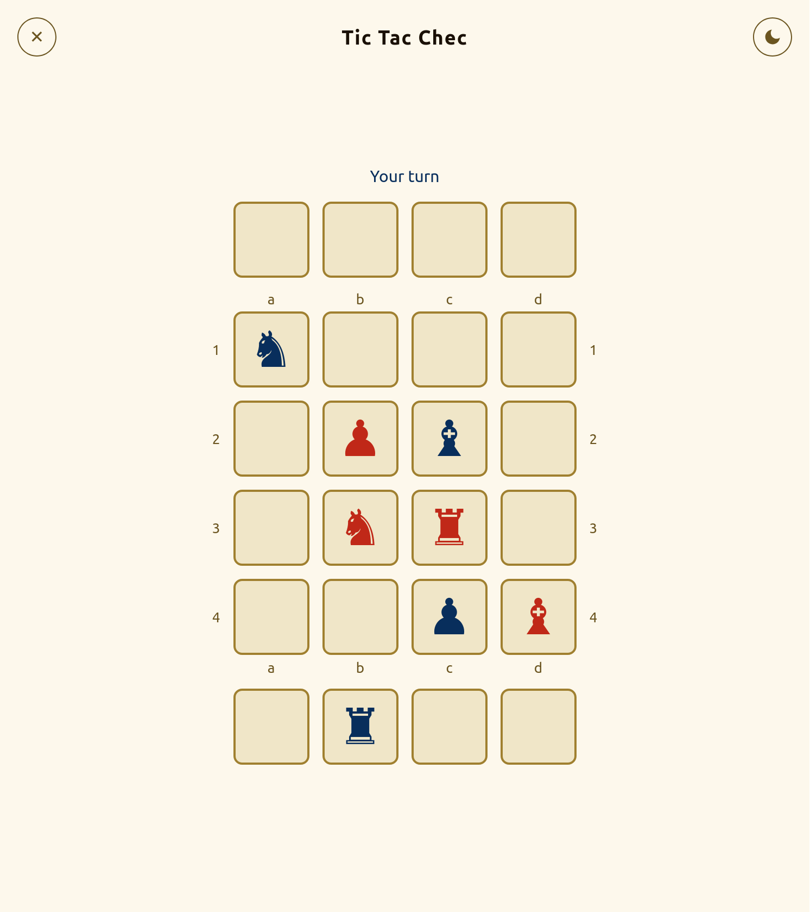
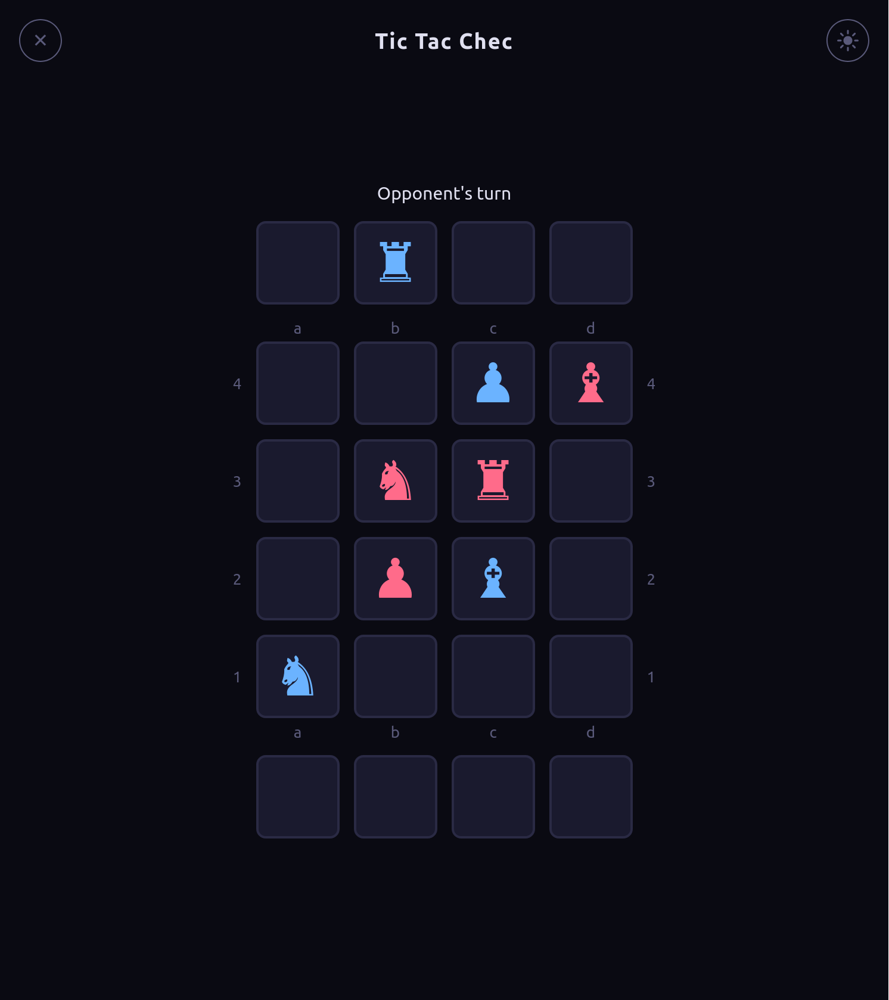
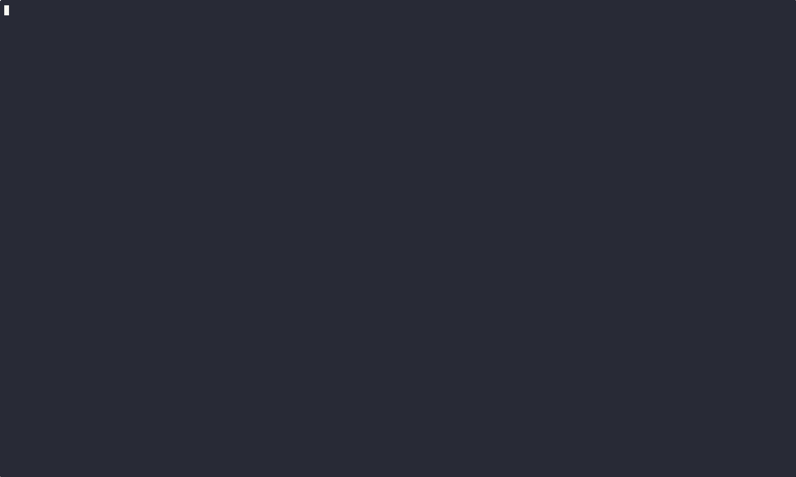

# Chess Tic-Tac-Toe (Tic Tac Chec)

A pet project to learn Go — a hybrid board game combining chess piece movement with tic-tac-toe win conditions. This is not vibe-coded: I write all the Go code myself, using Claude Code's [Learning output style](https://code.claude.com/docs/en/output-styles) which explains concepts and guides decisions rather than generating code for you.

## Rules

- 4×4 board, 2 players: White and Black
- Each player has 4 pieces: Pawn, Rook, Bishop, Knight
- On your turn: **place** a piece from hand onto any empty cell, or **move** a piece already on the board (chess-style movement)
- Capturing a piece returns it to its **owner's** hand (shogi-style)
- Pawns reverse direction when reaching the far edge
- **Win**: get 4 of your pieces in a row — horizontal, vertical, or diagonal

## Example

[](https://asciinema.org/a/EBRFrNjgfLJ6Q7rp)

## How to Run

```bash
go run ./cmd/tui/
```

## Play Online

### Web

Open [ttc.ctln.pw](https://ttc.ctln.pw) in a browser — no install needed.

<p align="center">
  
  
</p>

- Auto-pairing lobby
- Reconnection support (survives network drops, tab close/reopen)
- Rematch with color swap

### SSH

[](https://asciinema.org/a/y841iuATvfSxSNDF)

```bash
ssh ttc.ctln.pw -p 2222
```

- Auto-pairing lobby
- Turn indicator and board flip (Black sees the board from their side)
- In-game rules screen (`?`)

## Self-Hosting

Run both servers with Docker Compose (includes Caddy reverse proxy for HTTPS):

```bash
cp .env.example .env
docker compose up -d
```

This starts:
- **Web server** on port 80/443 (via Caddy reverse proxy)
- **SSH server** on port 2222

Configure your domain in `Caddyfile`. Players connect via browser or `ssh your-host -p 2222`.

SSH host keys are persisted in a Docker volume across redeploys.

### Optional analytics

Docker Compose loads runtime settings from `.env`. Start from the checked-in example and edit the values you need:

```bash
cp .env.example .env
```

The web app can load PostHog only when you enable it explicitly in `.env`:

```bash
ANALYTICS_ENABLED=true
POSTHOG_KEY=phc_your_project_key
POSTHOG_HOST=https://eu.i.posthog.com
```

## Claude Code Skill

Play against Claude in your terminal using the [Claude Code](https://docs.anthropic.com/en/docs/claude-code) skill.

[](https://asciinema.org/a/oq6SKUqsB7aM7iwm)

### How it works

The skill teaches Claude to play the game through a CLI binary. On each turn, Claude runs `tic-tac-chec-cli move` to make moves and reads the board output to decide its next action. You communicate moves in natural language ("pawn to b3") and Claude translates them into CLI commands.

When Claude loses, it performs a post-game analysis: reconstructs the game move-by-move, identifies where it went wrong, and writes a concrete lesson to the "Lessons Learned" section of its skill file (`~/.claude/skills/play-tic-tac-chec/SKILL.md`). If the same lesson appears three times, it gets promoted into the main Strategy section. Over time, Claude builds a personalized playbook from its failures.

### Requirements

- Go 1.25+
- [Claude Code](https://docs.anthropic.com/en/docs/claude-code) CLI

### Install

```bash
make install-skill
```

Then restart Claude Code and say `/play-tic-tac-chec`.

## Controls

| Key | Action |
|-----|--------|
| ↑ ↓ ← → / h j k l | Move cursor |
| Enter / Space | Select piece / confirm move |
| ? | Rules screen |
| N | New game (after game over) |
| C | Cycle color scheme |
| S | Toggle status overlay |
| Q | Quit |
